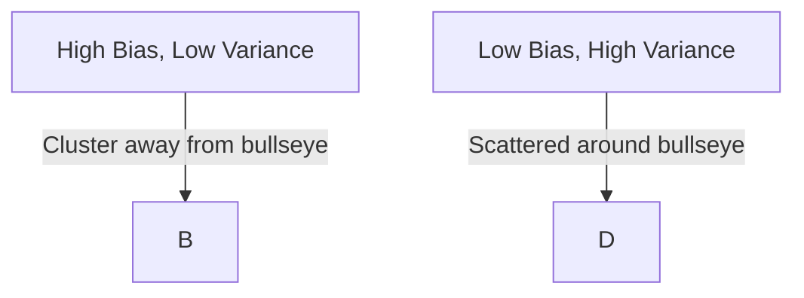

# Week 6 Day 3: Comprehensive Lecture Notes
## Overfitting, Underfitting & Classical Regularization

**Course:** 21CSE558T - Deep Neural Network Architectures
**Duration:** 2 Hours
**Date:** September 15, 2025
**Instructor:** Prof. Ramesh Babu
**Structure:** WHY → WHAT → HOW with Real-World Analogies

---

## 🎯 Session Overview

Today we're solving one of the biggest challenges in deep learning: **the generalization problem**. We'll use powerful analogies to understand why models fail, what overfitting really means, and how regularization techniques can save the day.

**Learning Objectives:**
- Understand bias-variance tradeoff through real-world analogies
- Detect overfitting patterns using practical examples
- Master L1 and L2 regularization with implementation guidance
- Make informed decisions about regularization techniques

---

# 📖 HOUR 1: OVERFITTING & UNDERFITTING MASTERY

## 🍽️ Topic 1: Bias-Variance Tradeoff (30 minutes)

### WHY: The Restaurant Chef Dilemma (10 minutes)

**🎭 The Analogy:**
Imagine you're training to become a chef. There are two approaches:

**Chef A (High Bias - Underfitting):**
- Learns only basic recipes: "Salt + Pepper + Heat = Good Food"
- Simple approach, but misses nuances
- Consistent results, but always mediocre
- **Real ML:** Linear model trying to fit complex data

**Chef B (High Variance - Overfitting):**
- Memorizes every single recipe detail perfectly
- Knows exactly how Mrs. Smith likes her pasta on Tuesdays
- Perfect in training kitchen, disasters in new restaurants
- **Real ML:** Complex model memorizing training data

**Chef C (Balanced - Good Fit):**
- Learns fundamental cooking principles
- Adapts techniques to new ingredients and customers
- Consistent excellence across different situations
- **Real ML:** Well-regularized model that generalizes

**🎯 Key Insight:** The goal isn't perfect performance on training data—it's being good enough to handle any real-world situation!

**💡 Interactive Question:** "Which chef would you hire for your restaurant? Why?"

### WHAT: The Archer's Target (15 minutes)

**🎯 The Archery Analogy:**

Picture an archer shooting arrows at a target:

**High Bias (Systematic Error):**
- Archer consistently shoots to the left of bullseye
- Arrows clustered together, but wrong location
- **Math:** Model predictions consistently away from true values
- **Formula:** Bias = E[f̂(x)] - f(x)

**High Variance (Inconsistency):**
- Arrows scattered all over the target
- Some hit bullseye, some miss completely
- **Math:** Model predictions vary wildly with different training sets
- **Formula:** Variance = E[(f̂(x) - E[f̂(x)])²]

**Low Bias + Low Variance (Skilled Archer):**
- Arrows clustered around bullseye
- Consistent accuracy across multiple attempts
- **Math:** Predictions close to true values with low spread

**📊 The Mathematical Truth:**
```
Total Error = Bias² + Variance + Irreducible Error
```

![[bulleye.png]]


**🎯 Visual Exercise:**
*Show 4 target diagrams representing different bias-variance combinations*



1. **Low Bias, Low Variance:** Tight cluster at bullseye ✅
2. **Low Bias, High Variance:** Scattered around bullseye
3. **High Bias, Low Variance:** Tight cluster away from bullseye
4. **High Bias, High Variance:** Scattered away from bullseye ❌

**💭 Real-World Connection:**
- **Medical Diagnosis:** Consistent wrong diagnosis vs. inconsistent diagnosis
- **Weather Prediction:** Always predicting wrong season vs. random predictions
- **Stock Trading:** Systematic pessimism vs. random guessing

### HOW: Medical Diagnosis Approach (5 minutes)

**🏥 The Doctor's Diagnostic Process:**

Just like doctors use symptoms to diagnose illness, we use patterns to diagnose model problems:

**Diagnostic Checklist:**
```python
# Bias-Variance Diagnosis Framework
def diagnose_model_health(train_score, val_score, train_history, val_history):
    """
    Like a medical checkup for your model
    """
    if train_score < 0.8 and val_score < 0.8:
        return "High Bias - Underfitting (Model too simple)"

    elif train_score > 0.95 and val_score < 0.7:
        return "High Variance - Overfitting (Model too complex)"

    elif abs(train_score - val_score) < 0.05:
        return "Healthy Model - Good Balance"

    else:
        return "Need more investigation"
```

**🔍 Practical Detection Methods:**
1. **Learning Curves:** Plot training vs validation performance
2. **Cross-Validation:** Check consistency across different data splits
3. **Error Analysis:** Examine where predictions fail
4. **Complexity Sweeps:** Test different model complexities

---

## 💔 Topic 2: Overfitting Detection (30 minutes)

### WHY: The Relationship Red Flags (10 minutes)

**💕 The Dating Analogy:**

**Scenario:** You meet someone who seems absolutely perfect...

**The "Perfect" Partner (Overfitted Model):**
- Knows exactly how you like your coffee ☕
- Remembers every inside joke you've shared
- Anticipates your every move perfectly
- **But...** completely falls apart in new social situations

**Red Flags in Relationships = Red Flags in Models:**
1. **Too Perfect:** They never make mistakes (100% training accuracy)
2. **No Flexibility:** Can't adapt to new situations (poor validation)
3. **Memorization:** Knows details but misses big picture
4. **Social Anxiety:** Terrible with your friends (test data)

**🎯 The Realization:**
Healthy relationships (and models) require:
- **Understanding**, not memorization
- **Flexibility** to handle new situations
- **Balance** between attention to detail and big picture

**💡 Discussion Prompt:** "What are the warning signs in both relationships and machine learning?"

### WHAT: The Student Cramming vs Understanding (15 minutes)

**📚 The Study Strategies Analogy:**

**Student A - The Crammer (Overfitting):**
- Memorizes exact answers to practice questions
- Can recite textbook word-for-word
- Perfect scores on practice tests
- **Disaster on real exam:** Fails when questions are slightly different

**Student B - The Understander (Good Generalization):**
- Learns underlying principles and concepts
- Can explain ideas in their own words
- Good (not perfect) scores on practice tests
- **Success on real exam:** Adapts knowledge to new problems

**🔬 Mathematical Signs of "Academic Cramming" in Models:**

```
Overfitting Symptoms:
├── Training Accuracy: 98%+ ⚠️
├── Validation Accuracy: <80% 🚨
├── Gap: >15% difference 💥
└── Learning Curves: Diverging trends 📈📉
```

**📊 Visual Pattern Recognition:**

![[students-learning.png]]


```python
# The Tale of Two Learning Curves
def plot_learning_story():
    """
    Healthy Model: Training and validation curves stay close
    Overfitted Model: Training curve climbs, validation plateaus/drops
    """
    epochs = range(1, 101)

    # Healthy model
    train_healthy = 0.95 - 0.3 * np.exp(-epochs/20)
    val_healthy = 0.92 - 0.3 * np.exp(-epochs/25)

    # Overfitted model
    train_overfit = 0.99 - 0.4 * np.exp(-epochs/15)
    val_overfit = 0.85 - 0.2 * np.exp(-epochs/30) + 0.1 * np.sin(epochs/10)
```

**🎯 Real-World Consequences:**
- **Academic:** Failing actual exams despite perfect practice scores
- **Business:** ML model works in lab, fails in production
- **Medical:** Diagnostic system trained on one hospital fails at another
- **Finance:** Trading algorithm profitable in backtest, loses money live

### HOW: Early Warning System (5 minutes)

**🚨 The Smoke Detector for Models:**

Just like smoke detectors save houses from fires, we need early warning systems for overfitting:

**Implementation Strategy:**
```python
class OverfittingDetector:
    """
    Your model's personal bodyguard against overfitting
    """
    def __init__(self, patience=5, min_delta=0.01):
        self.patience = patience
        self.min_delta = min_delta
        self.best_val_loss = float('inf')
        self.wait = 0

    def check_overfitting(self, val_loss, train_loss):
        """
        Early intervention system
        """
        gap = train_loss - val_loss

        if gap > 0.1:  # Warning threshold
            print("⚠️ Overfitting detected! Consider regularization")

        if val_loss < self.best_val_loss - self.min_delta:
            self.best_val_loss = val_loss
            self.wait = 0
        else:
            self.wait += 1

        if self.wait >= self.patience:
            print("🛑 Early stopping triggered!")
            return True
        return False
```

**🎯 Monitoring Dashboard:**
- Real-time training vs validation metrics
- Automated alerts when gaps exceed thresholds
- Visual learning curve updates
- Automatic model checkpointing

---

# 🛡️ HOUR 2: CLASSICAL REGULARIZATION TECHNIQUES

## ✨ Topic 3: L1 Regularization - LASSO (25 minutes)

### WHY: Marie Kondo for Neural Networks (8 minutes)

**🏠 The Decluttering Analogy:**

**Marie Kondo's Philosophy:** "Keep only items that spark joy"
![[Pasted image 20250921200926.png]]
**Your Cluttered Neural Network:**
- 10,000 features (like items in your house)
- Some features are essential (favorite coffee mug)
- Many features are useless (that exercise equipment you never use)
- Some features are actively harmful (expired food)

**🧹 The L1 Decluttering Process:**

**Before L1 (Cluttered House):**
```
Kitchen: [coffee_maker, toaster, 47_unused_gadgets, moldy_cheese]
Features: [useful_feature_1, useful_feature_2, 9,998_random_features]
```

**After L1 (Minimalist Paradise):**
```
Kitchen: [coffee_maker, toaster]  # Only joy-sparking items
Features: [useful_feature_1, useful_feature_2]  # Only predictive features
```

**🎯 The "Spark Joy" Test for Features:**
- **Does this feature improve prediction?** → Keep
- **Does this feature add noise?** → Remove (weight = 0)
- **Does this feature correlate with others?** → Maybe keep one

**💡 Real-World Benefits:**
- **Faster Training:** Fewer parameters to optimize
- **Easier Interpretation:** Clear which features matter
- **Better Generalization:** Less noise, more signal
- **Cost Savings:** Fewer features to collect in production

**🤔 Thought Exercise:** "If you could only keep 10% of your model's features, which would they be?"

### WHAT: The Budget Allocation Problem (12 minutes)

**💰 The Company Budget Meeting Analogy:**

**Scenario:** You're the CEO allocating a $1M budget across departments

**Normal Budget (No Regularization):**
- Marketing: $400K
- R&D: $300K
- Sales: $250K
- HR: $50K
- **Total:** $1M

**L1 Budget Constraint (Absolute Budget Limit):**
```
Constraint: Σ|department_budget| ≤ $1M
```

**L1 Forces Tough Choices:**
- Marketing: $500K
- R&D: $300K
- Sales: $200K
- HR: $0 (eliminated!)
- **Result:** Some departments get zero budget (feature selection)

**🔷 Geometric Interpretation - The Diamond Constraint:**

In 2D feature space, L1 creates a diamond-shaped constraint:
```
|w₁| + |w₂| ≤ λ
```

**Why Diamond Shape Matters:**
- **Sharp Corners:** Force weights to exactly zero
- **Automatic Selection:** Model chooses which features to keep
- **Sparsity:** Many weights become exactly 0

**📊 Mathematical Foundation:**

```python
# L1 Regularization Mathematical Breakdown
def l1_regularized_loss(y_true, y_pred, weights, lambda_l1):
    """
    The complete L1 story in code
    """
    # Original loss (how wrong are our predictions?)
    original_loss = mean_squared_error(y_true, y_pred)

    # L1 penalty (how complex is our model?)
    l1_penalty = lambda_l1 * np.sum(np.abs(weights))

    # Total loss (balance accuracy vs simplicity)
    total_loss = original_loss + l1_penalty

    return {
        'original_loss': original_loss,
        'l1_penalty': l1_penalty,
        'total_loss': total_loss,
        'sparsity': np.sum(weights == 0) / len(weights)
    }
```

**🎯 The L1 Learning Process:**
1. **Gradient Descent:** "I want to minimize loss"
2. **L1 Penalty:** "But keep the model simple!"
3. **Compromise:** "I'll zero out unimportant weights"
4. **Result:** Sparse, interpretable model

### HOW: Hiring the Perfect Team (5 minutes)

**👥 The Startup Hiring Analogy:**

**Scenario:** You're hiring for a startup with limited budget

**L1 Hiring Strategy:**
- Hire only essential roles
- Each hire must justify their salary
- Fire underperforming employees quickly
- Result: Small, efficient team

**🔧 TensorFlow Implementation:**

```python
import tensorflow as tf

# Building your L1-regularized team
def build_l1_model(lambda_l1=0.01):
    """
    Hire only the features that earn their keep
    """
    model = tf.keras.Sequential([
        tf.keras.layers.Dense(
            128,
            activation='relu',
            kernel_regularizer=tf.keras.regularizers.l1(lambda_l1),
            name='selective_layer_1'
        ),
        tf.keras.layers.Dense(
            64,
            activation='relu',
            kernel_regularizer=tf.keras.regularizers.l1(lambda_l1),
            name='selective_layer_2'
        ),
        tf.keras.layers.Dense(10, activation='softmax', name='output')
    ])

    return model

# Monitor your team's efficiency
def analyze_feature_selection(model):
    """
    See which 'employees' (weights) got 'fired' (set to zero)
    """
    for i, layer in enumerate(model.layers[:-1]):
        weights = layer.get_weights()[0]
        sparsity = np.sum(np.abs(weights) < 0.001) / weights.size
        print(f"Layer {i+1}: {sparsity:.1%} weights eliminated")
```

**🎛️ Hyperparameter Tuning Guide:**

```python
# The Goldilocks Principle for Lambda
lambda_values = {
    'too_small': 0.0001,    # "Hire everyone" - No selectivity
    'too_large': 1.0,       # "Fire everyone" - All weights → 0
    'just_right': 0.01      # "Selective hiring" - Balanced approach
}
```

---

## ⚖️ Topic 4: L2 Regularization - Ridge (25 minutes)

### WHY: The Equal Opportunity Employer (8 minutes)

**🤝 The Fair Workplace Analogy:**
![[Pasted image 20250921201015.png]]
**Company Culture A (No Regularization):**
- Star employee gets 90% of all credit
- Other employees feel undervalued
- High turnover, unbalanced workload
- **ML Translation:** One feature dominates predictions

**Company Culture B (L2 Regularization):**
- Equal opportunity for all employees
- Everyone contributes to projects
- Balanced workload distribution
- **ML Translation:** All features contribute proportionally

**🌟 The "No Superstar" Policy:**

```
L2 Philosophy: "No single weight should dominate the model"
```

**Real-World Benefits:**
- **Stability:** No single feature can break the model
- **Fairness:** All relevant features get a voice
- **Robustness:** Model works even if some features are missing
- **Collaboration:** Features work together, not against each other

**💡 Interactive Question:** "Would you rather work in a company with one superstar or a balanced team? Why?"

### WHAT: Investment Portfolio Theory (12 minutes)

**📈 The Smart Investor Analogy:**

**Risky Portfolio (No Regularization):**
- 80% in one stock (Tesla)
- 20% in everything else
- **Risk:** If Tesla crashes, portfolio destroyed
- **ML Translation:** Model relies heavily on one feature

**Diversified Portfolio (L2 Regularization):**
- 10% in tech stocks
- 10% in healthcare
- 10% in energy
- ... balanced across sectors
- **Risk:** If one sector fails, others compensate
- **ML Translation:** Model spreads importance across features

**🔶 Geometric Interpretation - The Circle Constraint:**

In 2D feature space, L2 creates a circular constraint:
```
w₁² + w₂² ≤ λ
```

**Why Circle Shape Matters:**
- **Smooth Boundaries:** Weights shrink gradually, none eliminated
- **Proportional Shrinking:** All weights reduced proportionally
- **No Sparsity:** All features remain active

**📊 Mathematical Foundation:**

```python
# L2 Regularization: The Portfolio Diversification Math
def l2_regularized_loss(y_true, y_pred, weights, lambda_l2):
    """
    Invest wisely in all features
    """
    # Original loss (prediction accuracy)
    original_loss = mean_squared_error(y_true, y_pred)

    # L2 penalty (portfolio risk measure)
    l2_penalty = lambda_l2 * np.sum(weights ** 2)

    # Total loss (balance returns vs risk)
    total_loss = original_loss + l2_penalty

    return {
        'original_loss': original_loss,
        'l2_penalty': l2_penalty,
        'total_loss': total_loss,
        'weight_concentration': np.max(np.abs(weights)) / np.mean(np.abs(weights))
    }
```

**🎯 L2 vs L1 Comparison Table:**

| Aspect       | L1 (LASSO)                 | L2 (Ridge)               |
| ------------ | -------------------------- | ------------------------ |
| **Penalty**  | Σ\|wᵢ\|                    | Σwᵢ²                     |
| **Geometry** | Diamond                    | Circle                   |
| **Effect**   | Feature Selection          | Weight Smoothing         |
| **Sparsity** | Yes (weights → 0)          | No (weights → small)     |
| **Use Case** | Remove irrelevant features | Handle multicollinearity |
| **Analogy**  | Marie Kondo                | Equal Opportunity        |

### HOW: The Team Collaboration Model (5 minutes)

**🤝 The Basketball Team Analogy:**

**L2 Team Strategy:**
- Every player contributes to every game
- No single star player (balanced scoring)
- Team succeeds through collaboration
- Consistent performance across seasons

**🔧 TensorFlow Implementation:**

```python
def build_l2_model(lambda_l2=0.01):
    """
    Build a collaborative team where everyone contributes
    """
    model = tf.keras.Sequential([
        tf.keras.layers.Dense(
            128,
            activation='relu',
            kernel_regularizer=tf.keras.regularizers.l2(lambda_l2),
            name='collaborative_layer_1'
        ),
        tf.keras.layers.Dense(
            64,
            activation='relu',
            kernel_regularizer=tf.keras.regularizers.l2(lambda_l2),
            name='collaborative_layer_2'
        ),
        tf.keras.layers.Dense(10, activation='softmax', name='output')
    ])

    return model

# Compare team dynamics
def compare_regularization_effects():
    """
    See how L1 vs L2 changes your team composition
    """
    # Create test data
    X, y = make_regression(n_samples=100, n_features=20, noise=0.1)

    models = {
        'No Regularization': build_model(lambda_reg=0.0),
        'L1 Team (Selective)': build_l1_model(lambda_l1=0.1),
        'L2 Team (Collaborative)': build_l2_model(lambda_l2=0.1)
    }

    # Train and analyze each team
    for name, model in models.items():
        model.compile(optimizer='adam', loss='mse')
        model.fit(X, y, epochs=100, verbose=0)

        weights = model.layers[0].get_weights()[0].flatten()
        print(f"\n{name}:")
        print(f"  Active features: {np.sum(np.abs(weights) > 0.01)}/20")
        print(f"  Max weight: {np.max(np.abs(weights)):.3f}")
        print(f"  Weight distribution: {np.std(weights):.3f}")
```

**🎛️ Decision Framework: When to Use Which?**

```python
def choose_regularization(dataset_characteristics):
    """
    Your regularization consultant
    """
    if dataset_characteristics['many_irrelevant_features']:
        return "L1 - Need feature selection (Marie Kondo approach)"

    elif dataset_characteristics['multicollinearity']:
        return "L2 - Need weight balancing (Portfolio approach)"

    elif dataset_characteristics['interpretability_important']:
        return "L1 - Sparse models easier to explain"

    elif dataset_characteristics['stable_performance_needed']:
        return "L2 - Smoother, more robust predictions"

    else:
        return "Try both and cross-validate!"
```

---

# 🔄 SYNTHESIS & INTEGRATION (10 minutes)

## The Complete Toolkit: Real-World Decision Making

**🛠️ The ML Doctor's Prescription Guide:**

```python
class ModelDoctor:
    """
    Your ML health consultant
    """
    def diagnose_and_prescribe(self, symptoms):
        diagnosis = self.diagnose(symptoms)
        prescription = self.prescribe(diagnosis)
        return diagnosis, prescription

    def diagnose(self, symptoms):
        if symptoms['train_acc'] > 0.95 and symptoms['val_acc'] < 0.8:
            return "Overfitting - Patient memorizing instead of learning"
        elif symptoms['train_acc'] < 0.8 and symptoms['val_acc'] < 0.8:
            return "Underfitting - Patient needs more complexity"
        else:
            return "Healthy model - Patient is learning well"

    def prescribe(self, diagnosis):
        prescriptions = {
            "Overfitting": [
                "L1 regularization (feature selection therapy)",
                "L2 regularization (weight balancing therapy)",
                "Early stopping (intervention therapy)",
                "More training data (experience therapy)"
            ],
            "Underfitting": [
                "Increase model complexity",
                "Reduce regularization",
                "Feature engineering",
                "Better data preprocessing"
            ],
            "Healthy": [
                "Continue current approach",
                "Monitor for changes",
                "Consider deployment"
            ]
        }
        return prescriptions[diagnosis]
```

## 📝 Assessment Preparation Checklist

**✅ Unit Test 1 Mastery Checklist (Sep 19):**

**Mathematical Understanding:**
- [ ] Can derive bias-variance decomposition
- [ ] Understands L1 vs L2 penalty differences
- [ ] Can calculate regularization penalties manually
- [ ] Knows when to apply each technique

**Conceptual Understanding:**
- [ ] Can explain overfitting using real-world analogies
- [ ] Understands geometric interpretation of constraints
- [ ] Can identify overfitting from learning curves
- [ ] Knows hyperparameter tuning strategies

**Practical Implementation:**
- [ ] Can implement L1/L2 in TensorFlow
- [ ] Can set up overfitting detection systems
- [ ] Knows how to tune λ parameters
- [ ] Can interpret model sparsity patterns

## 🏠 Homework & Next Session Preview

**📚 Tonight's Mission:**
1. **Complete Tutorial T6** - Implement both L1 and L2 regularization
2. **Practice Analogies** - Explain concepts to a friend using our analogies
3. **Mathematical Review** - Work through penalty calculations
4. **Read Ahead** - Advanced regularization techniques (Dropout, BatchNorm)

**🔮 Day 4 Preview - Advanced Regularization:**
- Dropout: "The Random Absence Policy"
- Batch Normalization: "The Team Coordination System"
- Data Augmentation: "The Experience Multiplier"
- Early Stopping: "The Perfect Timing Strategy"

---

## 🎯 Key Takeaways

**Remember the Core Analogies:**
1. **Bias-Variance** = Restaurant Chef learning strategies
2. **Overfitting** = Relationship red flags + Student cramming
3. **L1 Regularization** = Marie Kondo + Budget constraints
4. **L2 Regularization** = Equal opportunity + Investment diversification

**The Regularization Wisdom:**
> "The art of machine learning is not in building perfect models, but in building models that fail gracefully and generalize beautifully."

**Tomorrow's Focus:**
> "We've learned to detect the disease (overfitting) and apply basic medicine (L1/L2). Next, we'll explore advanced treatments (Dropout, BatchNorm) that work at the architectural level."

---

*© 2025 Prof. Ramesh Babu | SRM University | Deep Neural Network Architectures*
*"Making complex concepts accessible through the power of analogy"*